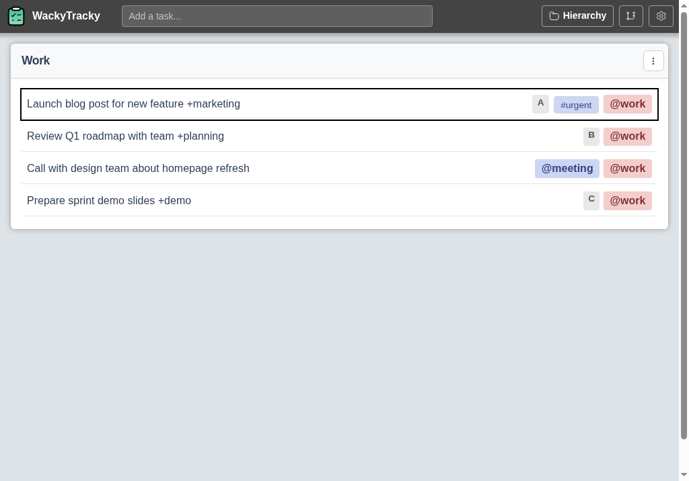
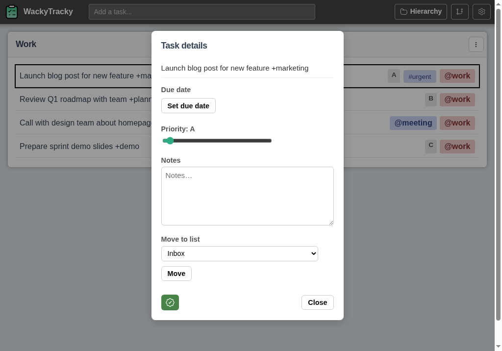
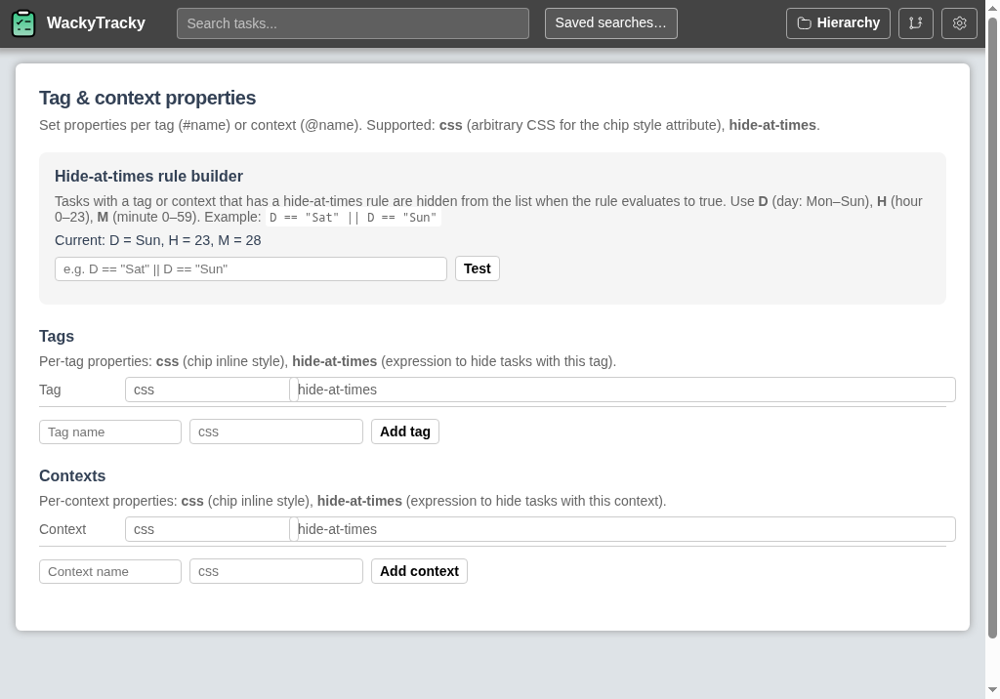

<div align = "center">
  
  <h1>WackyTracky</h1>

  Task tracking that gives power users full control over how they work.

  Web app, with desktop support that includes vim key bindings, and mobile support with offline+sync from a progressive web app (installable on your phone). The backend supports multiple database drivers, but the main focus is on the popular plain-text format [todo.txt](http://todotxt.org).

[](#misc)
[](https://discord.gg/jhYWWpNJ3v)
[-blue)](#misc)

 &bull; [Docker Compose Install](#deploy-with-docker-compose)

</div>

## Screenshots

**List view** — A list of tasks with priorities, tags, contexts, and due dates.


**Task options** — Right‑click a task to open the details panel (due date, priority, notes, move to list, mark done).


**TPPs** — Configure tags and contexts (labels, colors, order) in Options → TPPs.


## Features & Benefits

* **Flexible**: Use "Getting Things Done" or similar - flexible system for tags (#bob) and contexts (@home), and priorities (A-Z).
* **Durable**: Given the app is open source and self-hosted, you can run it for years without worrying about the company going out of business or changing the product.
* **Portable**: The project recommends the todotxt backend, which stores data in plain text files that can be easily moved, edited, and backed up. You can also switch to a different backend if needed.
* **Powerful**: vim key bindings, git integration.

## Documentation

Full documentation (MkDocs) is published to **GitHub Pages**: [https://jamesread.github.io/WackyTracky/](https://jamesread.github.io/WackyTracky/). The site is built from `docs/` and deployed automatically on push to `main` (see `.github/workflows/docs.yml`).

## Deploy with Docker Compose

Container images are published to GitHub Container Registry. Quick reference to run with Docker Compose:

```yaml
# docker-compose.yml
services:
  wackytracky:
    image: ghcr.io/jamesread/wacky-tracky:latest
    ports:
      - "8080:8080"
    volumes:
      # Config: mount a file at /app/config.yaml or a directory at /config (with config.yaml inside)
      - ./config.yaml:/app/config.yaml
      # Persist todotxt data (set database.database in config to /app/data/todotxt or similar)
      - todotxt-data:/app/data
volumes:
  todotxt-data:
```

Then run: `docker compose up -d`. The web UI and API are served on port 8080 by default (adjust the image’s listen port in your config if needed). Place a `config.yaml` in the same directory as your `docker-compose.yml` if you mount it; see the [documentation](https://jamesread.github.io/WackyTracky/) for config options.

## No-Nonsense Software Principles

This project follows these principles:

* **Open Source & Free Software**: following the [Open Source Definition](https://opensource.org/osd) and the [Free Software Definition](https://www.gnu.org/philosophy/free-sw.html). All code and assets are available under the [AGPL-3.0 License](LICENSE).
* **Independent**: No company owns the code or is responsible for the projects' governance.
* **Inclusive**: No "core", "pro", "premium" or "enterprise" version. The only version is the one you can download and run, and it has all the features.
* **Invisible**: No usage tracking, no user tracking, no ads, and no telemetry.
* **Internal**: No internet connection required for any functionality.

## Misc

* **AI autonomy:** This project is developed at [Level 3 (semi-autonomous)](https://blog.jread.com/posts/ai-levels-of-autonomy-in-software-engineering/): AI implements features and tests; humans define specs and direction. Specs and architecture are written by a human with 20 years of development experience. Aggressive non-AI static analysis, code-quality checks (e.g. cyclomatic complexity limits), and tests are in place to reinforce project quality.
* **Backend:** The service supports multiple database drivers (MySQL, Neo4j, YAML files, and [todo.txt](http://todotxt.org)) for different task systems. The **todotxt** driver is the one that by far receives the most focus and testing at the moment.
